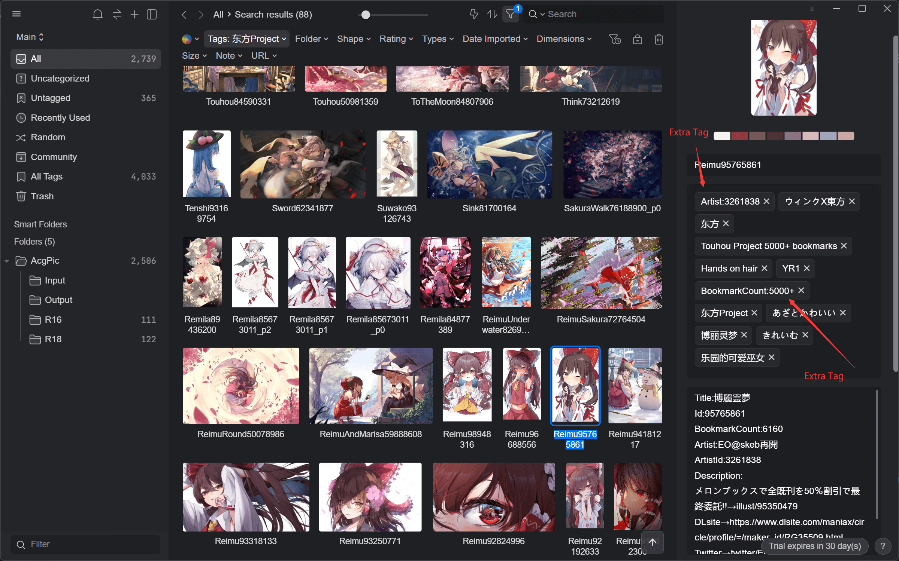

<div id="top"></div>

<h3 align="center">Pixiv To Eagle</h3>
  <p align="center">
    遍历 Eagle 中的 Pixiv 图片，抓取对应的 Pixiv 元数据写入 Eagle 中。
    <!-- <br /> -->
    <!-- <a href="https://clouder0.github.io/pixiv-metadata/zh/"><strong>查看文档 »</strong></a> -->
    <br />
    <a href="https://github.com/Clouder0/pixiv-metadata/blob/main/README.md/"><strong>English »</strong></a>
  </p>
</div>

## 📜 目录

<details><summary>Table of Contents</summary>

- [🌟 Badges](#🌟-badges)
- [💡 介绍](#💡-介绍)
- [✨ 特性](#✨-特性)
- [🎏 快速入门](#🎏-快速入门)
- [🗺️ 路线图](#🗺️-路线图)
- [❓ Faq](#❓-faq)
- [💌 贡献](#💌-贡献)
- [🙏 致谢](#🙏-致谢)
- [📖 许可](#📖-许可)
- [📧 联系](#📧-联系)

</details>

## 🌟 Badges

[![Test][github-action-test-shield]][github-action-test-url]
[![Codecov][codecov-shield]][codecov-url]
[![pre-commit-ci][pre-commit-ci-shield]][pre-commit-ci-url]
[![pepy-shield]][pepy-url]

[![release-shield]][release-url]
[![pyversions-shield]][pyversions-url]
[![Contributors][contributors-shield]][contributors-url]
[![Forks][forks-shield]][forks-url]
[![Stargazers][stars-shield]][stars-url]
[![Issues][issues-shield]][issues-url]
[![MIT License][license-shield]][license-url]
[![CodeFactor-shield]][CodeFactor-url]
[![code-style-black-shield]][code-style-black-url]

## 💡 介绍

这是一个遍历 Eagle 文件，识别出来自 Pixiv 的图片，然后抓取 Pixiv 上的元数据写入 Eagle 的小工具。

针对我自己的 use case 做了一些特化，如需使用可能需要自行修改一些代码。

具体的修改地点在 `pixiv_metadata/__main__.py` 中，搜索 `Modify Here`，有注释指引。

主要修改点在提取 Pixiv ID 的正则和获取需要处理的 Eagle 图片列表。注释中给出了一种最常见的格式。



<p align="right">(<a href="#top">回到顶部</a>)</p>

## ✨ 特性

- 异步处理，不到 10s 完成 2500 图片库的标注。
- 合并标签，原有的图片标签不损毁。
- 自助拓展，可通过元数据自己添加额外标签。(默认添加作者标签与收藏 10000+、5000+、1000+ 标签)
- 生成 Annotation，包含各种信息。
- 懒得编了。

<p align="right">(<a href="#top">回到顶部</a>)</p>

## 🎏 快速入门

<!-- 查看[快速入门文档](https://clouder0.github.io/pixiv-metadata/zh/quickstart/)来光速起步。 -->

首先 `git clone https://github.com/Clouder0/pixiv-metadata.git`.

然后安装 `requirements.txt` 中要求的包。

```bash
pip install -r requirements.txt
```

之后执行 `python -m pixiv_metadata` 即可。

由于很大可能需要自行修改，不发布到 pypi 了。

<p align="right">(<a href="#top">回到顶部</a>)</p>

## 🗺️ 路线图

<!-- 查看 [Github Project](https://github.com/Clouder0/pixiv-metadata/projects/1). -->

<!-- [Issues](https://github.com/Clouder0/pixiv-metadata/issues) 中包含了许多计划。 -->

没有路线，能用就行。

<p align="right">(<a href="#top">回到顶部</a>)</p>

## ❓ FAQ

还没有人问过问题。

<p align="right">(<a href="#top">回到顶部</a>)</p>

## 💌 贡献

Contributions are what make the open source community such an amazing place to learn, inspire, and create. Any contributions you make are **greatly appreciated**.

If you have a suggestion that would make this better, please fork the repo and create a pull request. You can also simply open an issue with the tag "enhancement".
Don't forget to give the project a star! Thanks again!

1. Fork the Project
2. Create your Feature Branch (`git checkout -b feature/AmazingFeature`)
3. Commit your Changes (`git commit -m 'Add some AmazingFeature'`)
4. Push to the Branch (`git push origin feature/AmazingFeature`)
5. Open a Pull Request

Don't forget to see our [Contributing Guidelines](https://github.com/Clouder0/pixiv-metadata/blob/main/CONTRIBUTING.md) for details.

<p align="right">(<a href="#top">回到顶部</a>)</p>

## 🙏 致谢

pixiv-metadata 构建于许多开源项目之上，没有它们，这个库不会存在。在此表示感谢。

- [aiohttp](https://github.com/aio-libs/aiohttp), Apache License 2.0
- [loguru](https://github.com/Delgan/loguru), MIT License

<p align="right">(<a href="#top">回到顶部</a>)</p>

## 📖 License

MIT 许可. 查看 `LICENSE` 文件以获取更多信息。

<p align="right">(<a href="#top">回到顶部</a>)</p>

## 📧 Contact

Clouder0 的邮箱: clouder0@outlook.com

仓库地址: [https://github.com/Clouder0/pixiv-metadata](https://github.com/Clouder0/siyuanhelper)

<p align="right">(<a href="#top">回到顶部</a>)</p>

<!-- MARKDOWN LINKS & IMAGES -->
<!-- https://www.markdownguide.org/basic-syntax/#reference-style-links -->
[contributors-shield]: https://img.shields.io/github/contributors/Clouder0/pixiv-metadata.svg?style=for-the-badge
[contributors-url]: https://github.com/Clouder0/pixiv-metadata/graphs/contributors
[forks-shield]: https://img.shields.io/github/forks/Clouder0/pixiv-metadata.svg?style=for-the-badge
[forks-url]: https://github.com/Clouder0/pixiv-metadata/network/members
[stars-shield]: https://img.shields.io/github/stars/Clouder0/pixiv-metadata.svg?style=for-the-badge
[stars-url]: https://github.com/Clouder0/pixiv-metadata/stargazers
[issues-shield]: https://img.shields.io/github/issues/Clouder0/pixiv-metadata.svg?style=for-the-badge
[issues-url]: https://github.com/Clouder0/pixiv-metadata/issues
[license-shield]: https://img.shields.io/github/license/Clouder0/pixiv-metadata.svg?style=for-the-badge
[license-url]: https://github.com/Clouder0/pixiv-metadata/blob/main/LICENSE
[github-action-test-shield]: https://github.com/Clouder0/pixiv-metadata/actions/workflows/test.yml/badge.svg?branch=main
[github-action-test-url]: https://github.com/Clouder0/pixiv-metadata/actions/workflows/test.yml
[codecov-shield]:https://codecov.io/gh/Clouder0/pixiv-metadata/branch/main/graph/badge.svg?token=D2XT099AFB
[codecov-url]: https://codecov.io/gh/Clouder0/pixiv-metadata
[pre-commit-ci-shield]: https://results.pre-commit.ci/badge/github/Clouder0/pixiv-metadata/main.svg
[pre-commit-ci-url]: https://results.pre-commit.ci/latest/github/Clouder0/pixiv-metadata/main
[code-style-black-shield]: https://img.shields.io/badge/code%20style-black-000000.svg?style=for-the-badge
[code-style-black-url]: https://github.com/psf/black
[pyversions-shield]: https://img.shields.io/pypi/pyversions/pixiv-metadata.svg?style=for-the-badge
[pyversions-url]: https://pypi.org/project/pixiv-metadata/
[release-shield]: https://img.shields.io/github/release/Clouder0/pixiv-metadata.svg?style=for-the-badge
[release-url]: https://github.com/Clouder0/pixiv-metadata/releases
[CodeFactor-shield]: https://www.codefactor.io/repository/github/clouder0/pixiv-metadata/badge/main?style=for-the-badge
[CodeFactor-url]: https://www.codefactor.io/repository/github/clouder0/pixiv-metadata/overview/main
[pepy-shield]: https://static.pepy.tech/personalized-badge/pixiv-metadata?period=total&units=international_system&left_color=grey&right_color=brightgreen&left_text=Downloads
[pepy-url]: https://pepy.tech/project/pixiv-metadata
